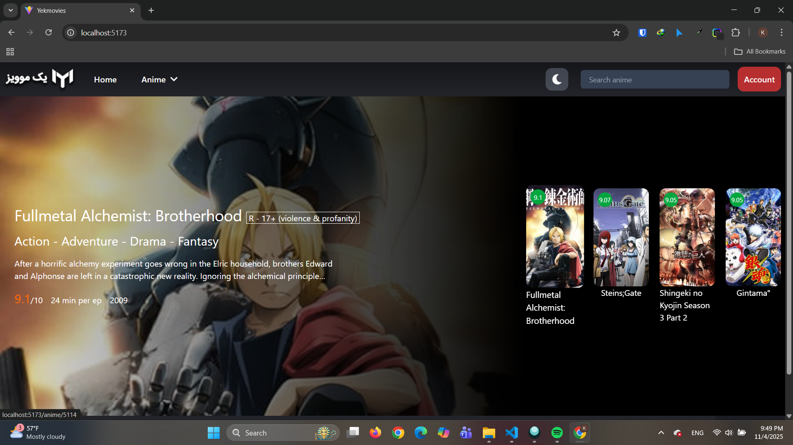
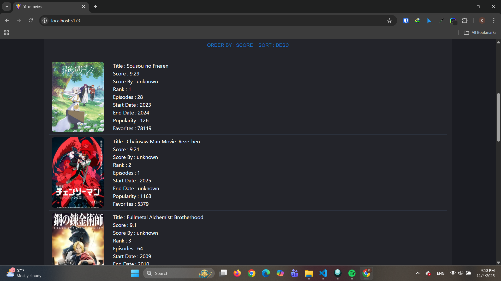
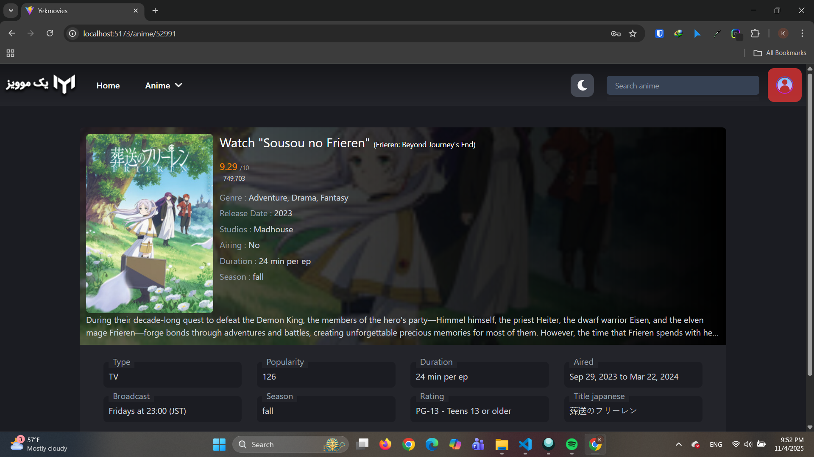
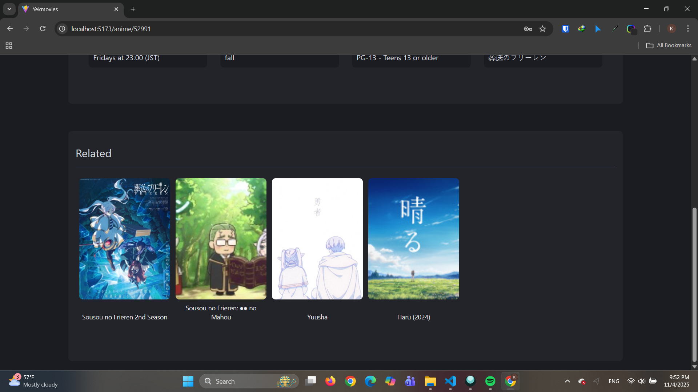
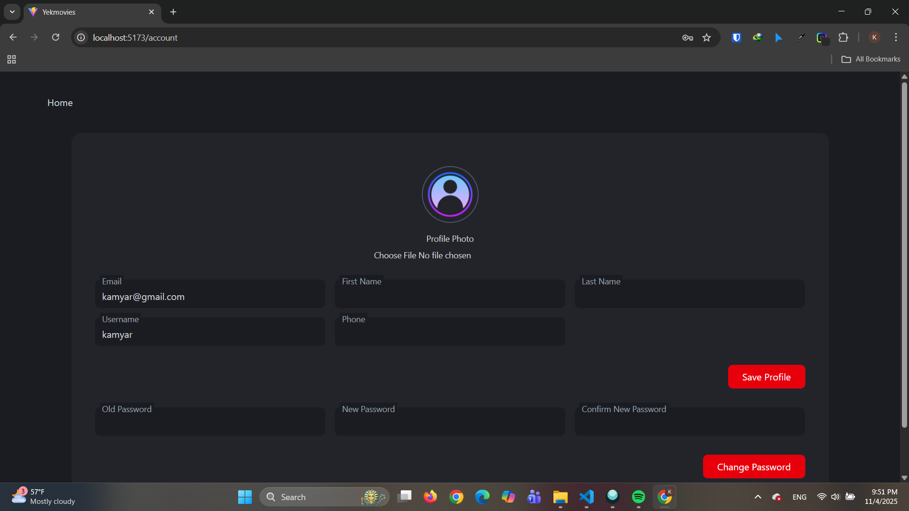
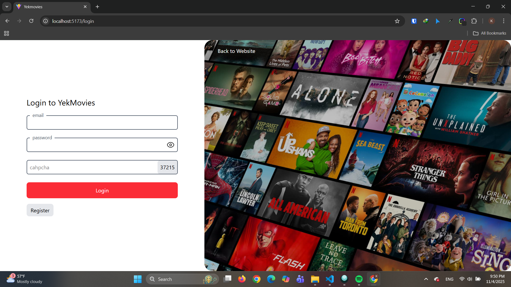

# YekMoviez Clone

A full-stack movie streaming platform built with **Django** and **React**, inspired by [YekMoviez](https://yekmoviez.com). This platform allows users to browse movies, series, and anime with a modern, responsive interface.

---

## 📸 Screenshots

<div align="center">

### Homepage




### Anime Detail




### User Profile




</div>

---

## Features

### Backend (Django + DRF)

-   User authentication using **JWT tokens**
-   Custom user model with admin access
-   REST APIs for user management and profile updates
-   PostgreSQL database (configurable to SQLite for development)
-   **Note:** CAPTCHA implementation is for demonstration purposes only

### Frontend (React + Tailwind + Swiper)

-   Displays **top animes ordered by score** on the homepage
-   Anime search powered by **Jikan API** (shows top results by score)
-   Responsive UI with **Tailwind CSS**
-   Swiper carousel for featured anime
-   Axios for API requests

---

## Tech Stack

-   **Backend:** Django, Django REST Framework, Simple JWT, PostgreSQL
-   **Frontend:** React, Tailwind CSS, Swiper, Axios, React Router DOM
-   **Tools:** Vite, ESLint, Prettier

---

## Installation / Setup

### Backend

1. **Clone the repository**

    ```bash
    git clone https://github.com/KamyarKhoshkalam/movie-website.git
    cd backend
    ```

2. **Create and activate a virtual environment**

    ```bash
    python -m venv venv
    source venv/bin/activate   # Linux/macOS
    venv\Scripts\activate      # Windows
    ```

3. **Install dependencies**

    ```bash
    pip install -r requirements.txt
    ```

4. **Database Configuration**

    **Option 1: PostgreSQL (Default)**

    ```env
    DEBUG=True
    DATABASE_NAME=yekmoviez_db
    DATABASE_USER=your_username
    DATABASE_PASSWORD=your_password
    SECRET_KEY=your-secret-key-here
    ```

    **Option 2: SQLite (Easier for testing)**

    ```python
    # In backend/movie_api/settings.py, change DATABASES to:
    DATABASES = {
        'default': {
            'ENGINE': 'django.db.backends.sqlite3',
            'NAME': 'db.sqlite3',
        }
    }
    ```

    _No .env file needed for SQLite_

5. **Run migrations**

    ```bash
    python manage.py makemigrations
    python manage.py migrate
    ```

6. **Create superuser (for admin access)**

    ```bash
    python manage.py createsuperuser
    ```

7. **Start backend server**
    ```bash
    python manage.py runserver
    ```

---

### Frontend

1. **Navigate to frontend folder**

    ```bash
    cd ../frontend
    ```

2. **Install dependencies**

    ```bash
    npm install
    ```

3. **Start development server**

    ```bash
    npm run dev
    ```

4. Open your browser and go to `http://localhost:5173`

**Notes:**

-   Backend runs at `http://127.0.0.1:8000`
-   Frontend communicates with backend via JWT authentication
-   CAPTCHA verification is simulated for UI demonstration

---

## Usage

-   Browse featured anime on the homepage carousel
-   Search for anime using the search functionality
-   Register and login with user authentication
-   Update user profile information
-   **Note:** CAPTCHA validation is simulated for UI purposes

---

## Backend Dependencies

```
Django
djangorestframework
django-cors-headers
PyJWT
```

## Frontend Dependencies

-   React, React DOM, Tailwind CSS, Swiper, Axios, React Router DOM

---

## Project Structure

```
movie-website/
├── backend/                 # Django backend
│   ├── movie_api/          # Django project
│   ├── api/                # Django app (users, movies)
│   ├── manage.py
│   └── requirements.txt
├── frontend/               # React frontend
│   ├── src/
│   │   ├── components/     # React components
│   │   ├── pages/          # Page components
│   │   └── services/       # API services
│   ├── package.json
│   └── vite.config.js
├── screenshots/            # Project screenshots
│   ├── homepage.png
│   ├── search.png
│   └── profile.png
└── README.md
```

---

## Important Notes

-   This project is for **educational and portfolio purposes**
-   CAPTCHA implementation is **simulated** and not functional
-   All movie/anime data is sourced from external APIs
-   User data is handled securely with JWT authentication
-   **SQLite can be used instead of PostgreSQL** for easier testing and development

---

## Contributing

Contributions are welcome! Feel free to fork the repository and submit pull requests.

---

## License

This project is developed for **educational purposes** and personal portfolio demonstration.
